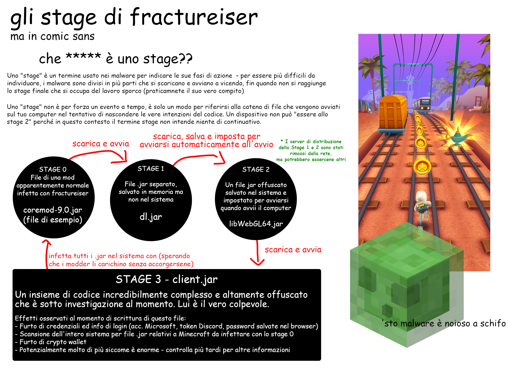

# Guida per i giocatori moddati

Se giochi **solo** al gioco vanilla da un launcher fidato come quello ufficiale o Prism e non hai mai usato una mod: sei al sicuro, 100%. Stai alla larga dalle mod per ora.

Se giochi a Minecraft con le mod dovresti controllare se sei stato infettato dal malware fractureiser per assicurarti che il tuo dispositivo ed i tuoi dati non siano in pericolo. Puoi farlo seguendo le istruzioni più sotto.

### È ancora in corso??
**No. Beh, più o meno.**  
Per ora, in base a quanto ne sappiamo, crediamo che il virus `fractureiser` sia stato completamente eliminato da mod e modpack pubblici. 

Al momento raccomandiamo ai giocatori che hanno usato lo strumento per la ricerca dello stage2 da questa pagina di continuare a giocare; dato però che i caricamenti delle mod sono stati riattivati sia su CurseForge che su Modrinth, è possibile che altri autori di malware creino nuovi virus.

Siamo in contatto con tutte le parti interessate al fine di stabilire protocolli per evitare che si ripeta in futuro.

Se vuoi giocare è consigliato seguire i passaggi di controllo in questa pagina e leggere anche la sezione riguardo a cosa fare se non si è infetti.

### Indice
* [Cosa è successo realmente?](#cosa-è-successo-realmente)
* [Sono infetto?](#sono-infetto)
* [Sono infetto, e adesso?](#sono-infetto-e-adesso)
* [Non sono infetto, e adesso?](#non-sono-infetto-e-adesso)
* [Domande frequenti (FAQ)](#domande-frequenti-faq)
* [FAQ tecniche](#faq-tecniche)

Se hai qualsiasi domanda riguardo fractureiser leggi prima questa pagina per intero, incluse le domande frequenti in fondo, siccome molte domande che riceviamo trovano già risposta qui.

## Cosa è successo realmente?

Alcune mod e alcuni plugin apparentemente inermi sono stati caricati dal creatore del malware sul sito di mod CurseForge e sull'hub di plugin dev.craftbukkit.org (non il software Bukkit in sé). Uno sviluppatore di modpack di alto profilo ha scaricato una di queste mod per provarla, ma questa ha infettato i file nel suo computer - inclusa una copia di un progetto che è stato poi caricato su CurseForge come file legittimo, ma con il virus incluso.

Questo processo si è poi ripetuto per altri utenti di CurseForge e dev.craftbukkit.org, infettando copie di molti plugin e mod popolari. *Ci sono segnalazioni di jar di mod e plugin sospetti già a partire da metà Aprile*

Contemporaneamente l'autore del malware ha tentato l'accesso forzato agli account di importanti content creator su CurseForge. Siamo incerti se la violazione fosse dovuta a questi tentativi di accesso o all'infezione trojan subita dai proprietari degli account.

Questo malware è composto da più "stage", ognuno dei quali è responsabile del download e dell'esecuzione del successivo. In totale sono stati individuati tre Stage (Stage 1, 2, 3) più uno "Stage 0" associato ai file infetti e che avvia l'infezione.

Lo Stage 3 è il vero "cervello" del malware, e abbiamo delle prove che faccia quanto segue:
* si propaga su *tutti* i file `jar` presenti sul sistema, probabilmente infettando anche mod che non sono state scaricate da CurseForge o BukkitDev, o altri programmi Java
* ruba i cookie e le informazioni di login da molti browser
* sostituisce gli indirizzi crypto negli appunti con altri di proprietà del creatore del malware
* ruba le credenziali di Discord
* ruba le credenziali di Microsoft e Minecraft

(Vedi i [dettagli tecnici](tech.md) per più informazioni)

Dato il suo comportamento siamo **abbastanza certi** nel dire che si tratta di un **attacco mirato all'ecosistema moddato di Minecraft**. Ed è abbastanza brutto. 

**Fino ad altre indicazioni, scarica le mod per Minecraft con estrema cautela, indipendentemente dalla sorgente.** Nonostante i server di controllo del malware siano attualmente offline, **qualsiasi download da CurseForge o la repository dei plugin di Bukkit nelle ultime 2-3 settimane è da considerarsi potenzialmente sospetto**. Alcuni antivirus hanno già iniziato ad aggiungere le firme ai loro database, ma in attesa che arrivi a tutti continua ad agire con cautela.

*A questo punto non possiamo affermare con certezza che altri servizi di hosting non siano infetti*. Usa con cautela qualsiasi sito. Anche le repository Maven potrebbero essere infette, e questo malware risale anche a mesi fa.

Al momento nuove infezioni sono impossibili siccome i server di attacco sono stati disattivati, ma le infezioni esistenti potrebbero essere ancora attive.

<!--### Taglia corto, come risolvo?

-->

### Aspetta, che ***** è uno "stage"?



## Sono infetto?

Il malware si presenta in più stage, quindi chiedere se si è infetti si concretizza in due domande

### Le mie mod hanno lo Stage 0?
Esistono vari scanner che, dato un file di una mod, possono individuare se questo è infetto dallo Stage 0.

* [Scanner](https://github.com/overwolf/jar-infection-scanner/releases) di Overwolf
  * È consigliato usare questo per controllare l'intero gioco - seleziona semplicemente la cartella di installazione di CurseForge o dove sono le istanze di gioco
  * Si tratta di un programma standalone, non richiede l'app di Overwolf
* [Scanner online](https://douira.github.io/fractureiser-web-detector/) di douira
* [nekodetector] di cortex
  * Clicca su "Assets" per mostrare i file eseguibili - richiede Java 

Se isolata, l'infezione dello Stage 0 non è pericolosa se i file vengono eliminati e mai eseguiti.

### Ci sono file dello Stage 2 sul mio sistema?

Perché siano presenti i file dello Stage 2 devono essere stati eseguiti correttamente lo Stage 0 e lo Stage 1. Se sono presenti il tuo caso è un'*infezione totale* e dovresti continuare a leggere le istruzioni in questo documento. 

Molti antivirus stanno iniziando ad individuare i file dello Stage 2. Se ottieni un avviso che dice di aver trovato e rimosso questi file procedi alla sezione "Sono infetto, e adesso?".

Altrimenti puoi controllare manualmente seguendo queste instruzioni in base al tuo sistema:

#### Istruzioni per Windows

* Apri il menù Start con il tasto Windows e scrivi `%localappdata%` - dovrebbe apparire così: 


* Dentro la cartella Local AppData devi assicurarti che nelle impostazioni di Esplora File siano abilitati sia gli `elementi nascosti` che i `file protetti di sistema`.
  * Per abilitarli vai in Visualizza > Opzioni
  * Se non sei sicuro puoi [trovare una spiegazione video qui](https://youtu.be/KLTlTlnXeKs) (in inglese).
  * Gli utenti con Windows 11 possono trovare le stesse opzioni sul pulsante "Visualizza" nel riquadro superiore e sul pulsante "..." a destra.

* Trova una cartella chiamata `Microsoft Edge`. Lo SPAZIO tra "Microsoft" ed "Edge" è importante - la cartella `MicrosoftEdge` è autentica ed è usata dal browser Edge. Il virus la crea con questo nome per nascondersi meglio.
  * La cartella autentica potrebbe anche chiamarsi `Microsoft/Edge` (una cartella `Edge` dentro la cartella `Microsoft`).
  * La cartella autentica *potrebbe* non esistere - se non hai alcuna cartella relativa a Edge, sei al sicuro.
  * Potrebbero anche esistere entrambe le cartelle autentiche, ed anche in questo caso va bene. 
* Se la cartella `Microsoft Edge` è presente sei infetto. Elimina permanentemente la cartella ed i suoi contenuti. 
  * Se la cartella non può essere cancellata, termina ogni programma Java attualmente in esecuzione attraverso Gestione Attività.

### Informazioni per macOS

Il malware non sembra prendere di mira macOS, quindi dovresti essere al sicuro.  
*Per sicurezza torna qui a controllare ogni tanto.*

#### Istruzioni per Linux

Per prima cosa assicurati che qualunque sia il modo con cui stai visualizzando i file ti permetta di vedere quelli nascosti. Molti file manager hanno la scorciatoia Ctrl+H per attivare/disattivare questi file. Se stai usando un terminale usa `ls -A` nelle rispettive cartelle, oppure `ls -lha` per una vista più dettagliata.

Se uno o più tra questi file esiste, sei infetto. Nel caso elimina tutti i file:
* `~/.config/systemd/user/systemd-utility.service`
* `/etc/systemd/system/systemd-utility.service`
* `~/.config/.data/lib.jar`

Dopo ciò controlla il tuo `journalctl` se disponibile e cerca modifiche sospette non eseguite da te. Per farlo, esegui i comandi `journalctl -exb` (per i log di sistema) e `journalctl -exb --user` (per i log dell'utente). Esegui poi questi comandi per riavviare i servizi di sistema:
```sh
sudo systemctl daemon-reload # Inserisci la password dell'utente
systemctl --user daemon-reload 
```

#### Script
*Se non sai come eseuire un script Powershell o Bash, salta questa sezione.*  
Script automatizzati di Powershell o Bash per il controllo dello Stage 2 sono disponibili [sul sito di PrismLauncher](https://prismlauncher.org/news/cf-compromised-alert/#automated-script), se possiedi le conoscenze per eseguirli. Anche Overwolf (la compagnia madre di CurseForge) ha pubblicato uno strumento C# per il rilevamento dello Stage 2:
https://github.com/overwolf/detection-tool

## Sono infetto, e adesso?
**IMPORTANTE**: Non conosciamo quali siano le ragioni o gli obiettivi di tutto questo, quindi esercita estrema cautela fin quando non verrà trovato un modo definitivo per rimuovere qualsiasi sintomo. Tutto ciò che trovi scritto è esclusivamente *quello che sappiamo* - resta all'erta per eventuali comunicazioni dal team riguardo a scoperte critiche.

Se hai trovato file dello Stage 2 sul tuo computer è molto probabile che anche il codice dello Stage 3 sia stato eseguito ed abbia infettato il tuo dispositivo. L'opzione migliore è assumere che il tuo sistema sia *interamente compromesso*. Ecco cosa dovresti fare:

* Fai un backup di tutto ciò che non vorresti perdere su una chiavetta USB o un disco removibile (dovresti già farlo regolarmente!)
* Usando un dispositivo diverso, cambia le password di tutti i servizi a cui avevi fatto accesso sul vecchio dispositivo (Discord, email ecc.). Preferibilmente usando un gestore di password come [BitWarden](https://bitwarden.com).
* Se non avevi l'autenticazione a due fattori attiva (app Authenticator o SMS) su ogni servizio che la supporta, inizia a configurarla immediatamente
* Se puoi, contatta un professionista nella tua zona e chiedigli di fare una diagnostica completa sul tuo dispositivo alla ricerca di qualunque cosa sospetta, o se vuoi andare sul sicuro formatta e reinstalla il sistema.
* Leggi la sezione qui sotto su cosa fare se non sei infetto dato che i passaggi si applicano anche al tuo caso.

## Non sono infetto, e adesso?

Se i rilevatori dello Stage 2 non hanno dato riscontro positivo, ci sono buone possibilità che non sia infetto e puoi continuare a giocare.

Mentre `fractureiser` è stato debellato, nuovi virus potrebbero apparire nel futuro prossimo fin quando non stabiliamo nuove regole. Se vuoi giocare ti raccomandiamo di:

* Giocare esclusivamente con mod e modpack già scaricati e che hai verificato essere puliti.
* Evitare di scaricare qualsiasi cosa caricata dopo l'8 giugno da autori nuovi o sconosciuti per gli stessi motivi del punto precedente.
* Evitare di aggiornare le tue mod/i tuoi modpack.
* Restare in contatto per comunicazioni riguardo a sviluppi su nuovi metodi per il rilevamento di problemi simili in futuro.

## Domande frequenti (FAQ)

### CurseForge è stato hackerato?
La compromissione non riguarda CurseForge in sè, solo utenti individuali. Non è problema di CurseForge, semplicemente è capitato che succedesse sulla loro piattaforma. CurseForge ha anche [pubblicato un articolo](https://support.curseforge.com/en/support/solutions/articles/9000228509-june-2023-infected-mods-detection-tool/) che descrive la situazione dal loro punto di vista e le contromisure che stanno adottando.

### Modrinth va bene?
Modrinth ha eseguito una scansione completa sui caricamenti degli ultimi 10 mesi senza trovare alcuna infezione. Raccomandiamo comunque di esercitare cautela indipendentemente da dove si scaricano le mod o simili. L'assenza di infezioni è dovuta a pura fortuna.  

### Modrinth è più sicuro?
Non è un problema a livello di sito web, Modrinth è sicuro quanto CurseForge.

### Come ha fatto CurseForge a non accorgesene?
Il codice dell'infezione allo Stage 0 non è propriamente sospetto agli occhi di un sistema automatizzato, e poteva essere benissimo un meccanismo usato da altre mod. Infatti i primi tentativi di individuare l'infezione da Stage 0 davano molti falsi positivi anche su mod popolari come la Quark.

Realisticamente parlando questo tipo di prevenzione a livello di piattaforma non è possibile per le infinite modalità con cui si può scrivere lo stesso codice per nascondere le vere intenzioni.

### Quali antivirus lo rilevano?
Mentre parliamo ne stanno venendo aggiunti di nuovi, ma per ora è consigliato eseguire la verifica manuale invece di affidarsi agli antivirus.

### Il multiplayer è sicuro?
Sì, non puoi essere infettato giocando a un server multiplayer se non scarichi mod per giocarci da qualch'altra parte.

### Bedrock è al sicuro?
Sì, sono Java è affetto.

### Client alternativi come Lunar o Badlion sono sicuri?
Leggi la risposta seguente.

### La Optifine è sicura? / Sodium è sicura? / Iris è sicura? / La Create è sicura? / L'Essential è sicura? / La mod (inserisci nome mod) è sicura?

**Non possiamo confermare la sicurezza di una qualsiasi mod al momento.**

Una delle funzioni dello Stage 3 del virus è quello di infettare quanti più .jar possibili presenti sul computer. Può infettare **tutti i `.jar`**, incluso Minecraft in sè (vanilla o moddato), mod di Minecraft, plugin Spigot e programmi Java senza che abbiano alcun collegamento con Minecraft. Se il tuo computer ha il codice dello Stage 3 non importa più se scarichi una mod "sicura" o meno - **verrà infettata**. Rileva e controlla gli ultimi Stage di fractureiser *prima di tutto*.

Al momento tutte le mod *rilevate* infette sono state rimosse da CurseForge. Hanno anche [pubblicato una lista delle mod infette conosciute](https://support.curseforge.com/en/support/solutions/articles/9000228509-june-2023-infected-mods-detection-tool/) (in fondo alla pagina) e le ha rimosse dal sito. Modrinth ha scansionato i 10 mesi precedenti di caricamenti e non ha trovato alcuna mod infetta.

Questo *non assicura però che alcune possano essere sfuggite ai controlli*. Per controllare se un dato jar contiene lo Stage 0 di fractureiser controlla la sezione [Sono infetto?](#sono-infetto) ed esecita massima cautela quando scarichi qualsiasi mod.

### Quanto è diffusa l'infezione?

CurseForge ha informato che i file infetti sono stati scaricati circa 6000 volte durante l'intero periodo di infezione. Citando dall'annuncio sul Discord di CF:
> Giusto per chiarezza, si tratta di circa il 0,015% dei download giornalieri per Minecraft su CurseForge.

### Era un tentativo per rovinare il lancio della 1.20?

Sembra essere una coincidenza - in realtà il malware era attivo anche da parecchio prima che venisse scoperto la mattina del rilascio della 1.20.

## FAQ tecniche

### Can fractureiser escape VMs (Virtual Machines)?

**No.**

stage3 *does* contain code for *attempting* a *manual* escape from the 
["Windows Sandbox"](https://learn.microsoft.com/en-us/windows/security/application-security/application-isolation/windows-sandbox/windows-sandbox-overview).
It does not happen automatically. If the virus is ran from the Windows Sandbox, it will try to
mess with the clipboard to trick you into pasting a shortcut to the malware.

Note that this sort of "clipboard escape" is nothing new and it is very easy to defeat by simply
not sharing the clipboard between the host and guest OS. Use a more heavyweight virtual-machine
than the "Windows Sandbox", and disable features like VirtualBox's "Guest Addons" or Hyper-V's
"integration services".

(*Real* virtual-machine escape exploits are worth millions of dollars and would not be burned on
some Minecraft kids, and we have reason to believe the author of this malware is not a very good
programmer in the first place.)

### Does this spread over the network?

As far as we know, fractureiser does not contain network spread functionality, but it is not fully
out of the question.  
A security researcher we are working with got an alert, but it ended up being about completely 
unrelated malware that happened to use a similar filename. This was just a false alarm.

### What are CurseForge and Modrinth doing about it?

CurseForge has developed an open-source [stage2/3 detection tool](https://github.com/overwolf/detection-tool) 
and [stage0 detection tool](https://github.com/overwolf/jar-infection-scanner), have scanned *all* 
uploaded mods/plugins for stage0 infections, and have deleted all *known* infection cases.

Modrinth has also scanned uploaded mods/plugins for stage0 infections going back 10 months and did 
not find any.

Both platforms are considering introducing some sort of automated "virus scan" process to the mod 
submission pipeline. It's hard, since Java malware like this is typically bespoke.

### What IP addresses and URLs should I block in my firewall/routing table?

fractureiser-related code has been observed to connect to these URLs and addresses over a wide 
variety of port numbers.

* The hardcoded address in stage0-infected mods, and the first observed command&control 
server: `85.217.144.130`
* The second observed command&control server: `107.189.3.101`
* The fallback URL that stage1 tries to use, and the stage2 command&control hostname: 
`files-8ie.pages.dev`

There's also evidence of it trying to connect to the hostname `v2202209151437200088` 
over port 25575 - unknown reasons; probably from an older version of the malware.

Here are some additional addresses to firewall related to skyrage stuff (again, *very* unlikely 
skyrage was downloaded to anyone's PC through this vector, but nothing good comes from these 
addresses anyway):

* `95.214.27.172`
* `connect.skyrage.de`
* `t23e7v6uz8idz87ehugwq.skyrage.de`
* `qw3e1ee12e9hzheu9h1912hew1sh12uw9.skyrage.de`
* *Probably just block all of `skyrage.de` honestly*

Should go without saying that you should not visit these.

### Can we make it against CurseForge/Modrinth rules for your mod to download other files?

It's already against CurseForge rules to upload malware. There are also many legitimate use cases 
for a mod to download files that this would also stifle.

### Would it be possible to include some sort of "antivirus" or "sandbox" in the modloader itself?

"Antivirus": Probably not, for the same reasons that regular antiviruses didn't detect it. 
Antiviruses can only detect known malware, not unknown malware.

Sandboxing: Including some sort of "does this class contain 'safe' code?" check before loading a 
class is a great way to spur on a cat-and-mouse game between malware developers and modloader 
developers.

It's really hard to ban Java code from using a specific class (say, `URLClassLoader`) because you 
can also refer to it with `Class.forName` (which has a ton of legitimate use-cases), and if you 
ban or deny-list classes from *that*, you can typically find something *else* on the classpath 
willing to call `Class.forName` for you, and trying to get rid of these gadgets is an endless 
game of whack-a-mole.

Sandboxing Java is pretty much impossible - see articles like 
["Twenty Years of Escaping the Java Sandbox"](https://www.exploit-db.com/papers/45517).

Java mods are simply bundles of arbitrary code: treat them like an `.exe`, they can do anything. 

### Why aren't mods cryptographically signed to prevent malware from tampering with them?

Part of the problem is that signatures alone do not prevent malware - a cryptographically-signed 
virus is still a virus - and if self-signing was permitted, it doesn't prevent tampering either - 
it's possible for a virus to simply strip digital signatures off a jar ("delete META-INF") and 
re-sign it with its own key. (This isn't a hypothetical, either: fractureiser does contain code to 
remove digital signatures from the jars it infects.)

Signed mods with online signature verification *does* seem like a somewhat promising way forward, 
though it's not without tradeoffs. There will be [a meeting](2023-06-08-meeting.md) with
many different reps from the modding ecosystem to discuss how to move forward.

### Would it be possible to forbid mods from downloading executable code?

It's not possible. You can't know whether a file contains executable code before you download it, 
and after a file is downloaded, you can't control what is done with it.

* What if my mod downloads a single Java class file?
* What about a Java class file but spelled backwards, so it doesn't look like a class file at first?
* What about a Java class file but encrypted?
* What about Java *source* code that is compiled on your computer?
* What about a Python script?
* What about a file containing English prose where it just so *happens* that sentences with an 
even number of words correspond to a 0, and sentences with an odd number of words correspond to 
a 1? - even though it's a prose document I can technically reassemble it into 
an `.exe`, if I so choose.

### Is this related to that Spigot plugin malware going around?

Possibly! There's some ties to the existing malware `skyrage` - the malware author uploaded a 
skyrage-relevant `.jar` to their backup command&control server, in a fruitless attempt to 
extend the attack, shortly before CloudFlare took it down anyway.

**We have not received any reports of anyone becoming infected by Skyrage through this vector.** 
The author updated their CloudFlare URL to point to Skyrage a significant length of time *after* 
the hardcoded IP address in stage0-infected mods was already taken down. It's mostly a funny 
curiosity that the attacker tried to serve this jar at all.

skyrage is an existing, well-studied piece of malware and you can find some more info about 
it [here](https://ljskatt.no/analysis/updater_class/).